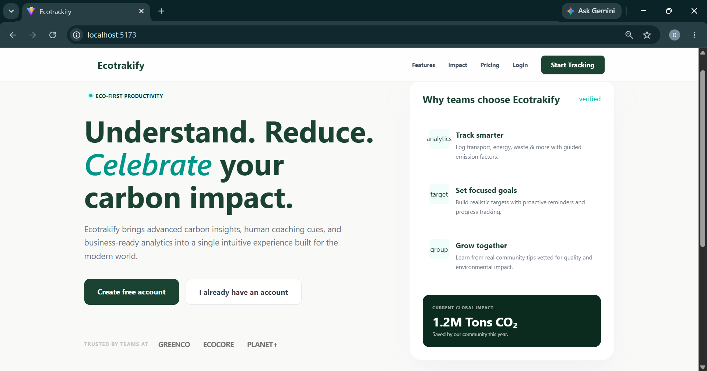
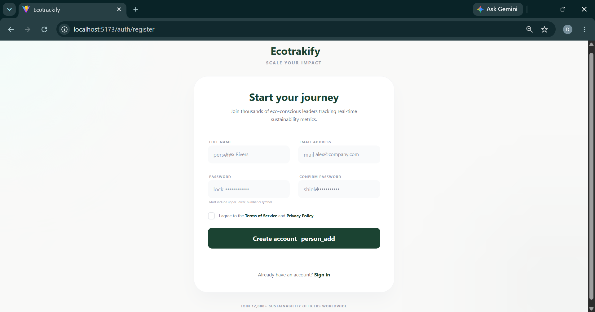
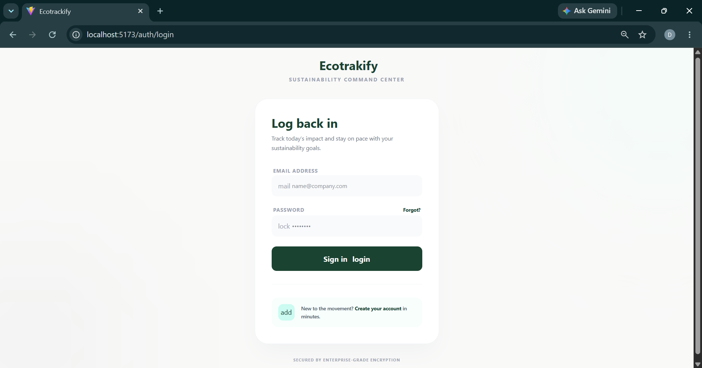
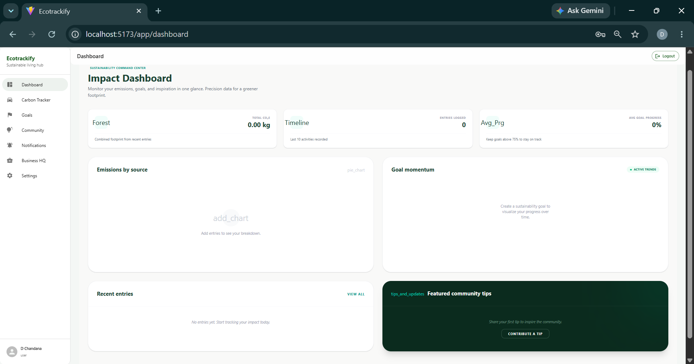
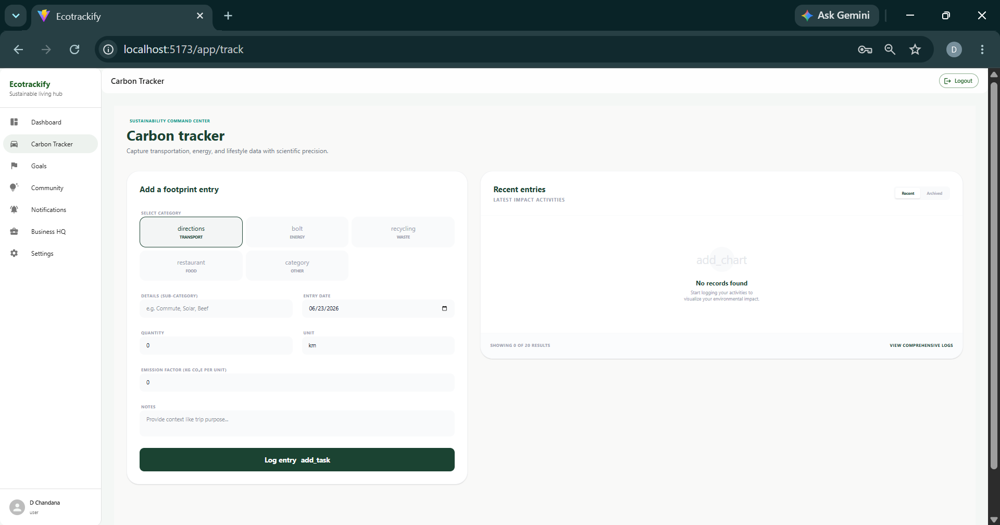
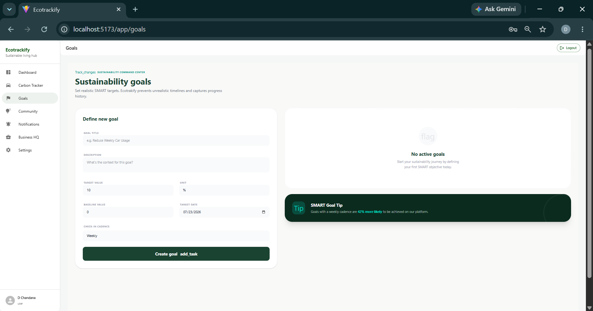
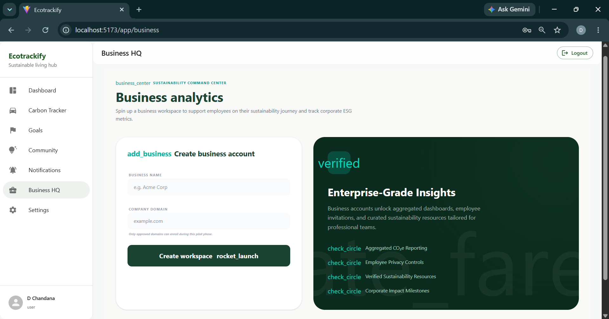
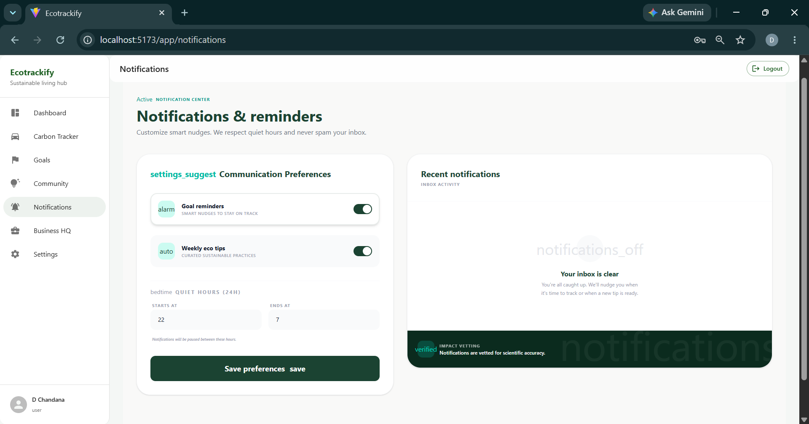
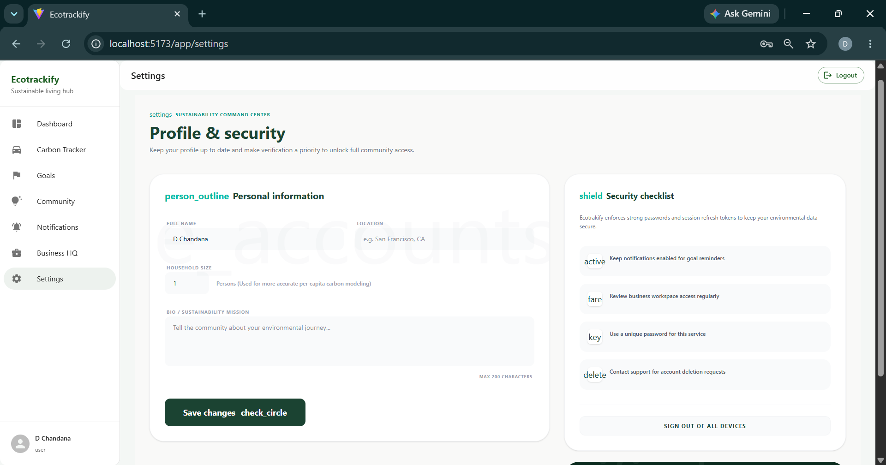
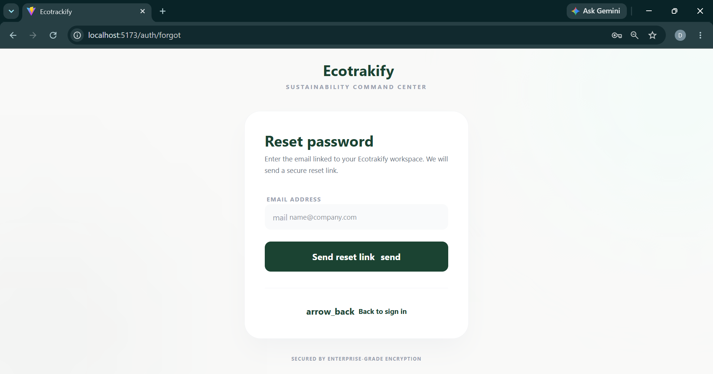

# 🌿 EcoTrackify

### A Modern MERN Platform for Carbon Footprint Tracking and Sustainable Living

EcoTrackify is a full-stack MERN web application designed to help individuals and businesses monitor, analyze, and reduce their carbon footprint. The platform combines environmental awareness with modern technology by providing real-time carbon tracking, sustainability goals, business analytics, and community engagement features.

The goal of EcoTrackify is to empower users to make eco-friendly decisions and contribute towards a greener future.

---

## ✨ Key Features

### 🔐 Authentication & Security

* Secure User Registration
* JWT Authentication
* Refresh Token Support
* Email Verification
* Forgot Password
* Password Reset
* Protected Routes
* Password Encryption using Bcrypt

---

### 🌍 Carbon Footprint Tracking

Users can:

* Track Transportation Emissions
* Monitor Household Electricity Usage
* Record Daily Activities
* Analyze Carbon Emissions
* View Environmental Impact

---

### 🎯 Sustainability Goals

* Create Personal Eco Goals
* Set Carbon Reduction Targets
* Monitor Goal Progress
* Visual Progress Tracking

---

### 🏢 Business Dashboard

Organizations can:

* Register Businesses
* Manage Sustainability Programs
* Monitor Organizational Emissions
* View Business Environmental Analytics

---

### 🔔 Notifications

* Goal Reminders
* Sustainability Alerts
* Community Notifications
* Environmental Updates

---

### 📱 Responsive User Interface

* Mobile Friendly Design
* Modern Dashboard
* Dark & Light Theme Support
* Professional UI Components
* Fully Responsive Layout

---

# 🛠 Tech Stack

## Frontend

* React 19
* Vite
* Tailwind CSS v4
* Material UI (MUI)
* React Router DOM
* Zustand
* React Query
* Recharts

---

## Backend

* Node.js
* Express.js
* JWT Authentication
* Nodemailer
* Bcrypt

---

## Database

* MongoDB
* Mongoose ODM

---

# 📂 Folder Structure

```text
🌿 EcoTrackify
│
├── 📁 client
│   │
│   ├── 📁 public
│   │
│   ├── 📁 src
│   │   │
│   │   ├── 📁 assets
│   │   ├── 📁 components
│   │   ├── 📁 hooks
│   │   ├── 📁 layouts
│   │   ├── 📁 pages
│   │   │
│   │   ├── 📁 auth
│   │   │   ├── LoginPage.jsx
│   │   │   ├── RegisterPage.jsx
│   │   │   └── ForgotPasswordPage.jsx
│   │   │
│   │   └── 📁 app
│   │       ├── DashboardPage.jsx
│   │       ├── CarbonTrackerPage.jsx
│   │       ├── GoalsPage.jsx
│   │       ├── CommunityPage.jsx
│   │       ├── BusinessPage.jsx
│   │       ├── NotificationsPage.jsx
│   │       └── SettingsPage.jsx
│   │
│   ├── 📁 services
│   ├── 📁 store
│   ├── 📁 theme
│   ├── 📁 utils
│   │
│   ├── App.jsx
│   ├── main.jsx
│   └── styles.css
│
│
├── 📁 server
│   │
│   ├── 📁 config
│   ├── 📁 controllers
│   ├── 📁 middleware
│   ├── 📁 models
│   ├── 📁 routes
│   ├── 📁 services
│   ├── 📁 utils
│   ├── 📁 validations
│   │
│   ├── app.js
│   ├── server.js
│   ├── package.json
│   └── package-lock.json
│
│
├── 📁 docs
│   │
│   └── 📁 screenshots
│
│       ├── landing-page.png
│       ├── login-page.png
│       ├── register-page.png
│       ├── forgotPassword-page.png
│       ├── dashboard.png
│       ├── carbontracker-page.png
│       ├── goals-page.png
│       ├── business-page.png
│       ├── notifications-page.png
│       └── settings-page.png
│
│
├── 📄 README.md
│
├── 📄 .gitignore
│
└── 📄 .env.example

```

---

# ⚙️ Installation Guide

## Step 1

Clone the repository

```bash
git clone https://github.com/DChandana317/EcoTrackify.git

cd EcoTrackify
```

---

## Step 2

Install Backend Dependencies

```bash
cd server

npm install
```

---

## Step 3

Install Frontend Dependencies

```bash
cd ../client

npm install
```

---

## Step 4

Configure Environment Variables

Create:

```bash
server/.env
```

Add:

```env
NODE_ENV=development

PORT=5000

MONGO_URI=mongodb://127.0.0.1:27017/ecotrackify

JWT_ACCESS_SECRET=your_access_secret

JWT_REFRESH_SECRET=your_refresh_secret

JWT_ACCESS_EXPIRES_IN=15m

JWT_REFRESH_EXPIRES_IN=7d

EMAIL_FROM=your_email

SMTP_HOST=smtp.gmail.com

SMTP_PORT=465

SMTP_USER=your_email

SMTP_PASS=your_gmail_app_password

CLIENT_URL=http://localhost:5173

RATE_LIMIT_WINDOW_MS=60000

RATE_LIMIT_MAX=100

BUSINESS_DOMAIN_WHITELIST=ecotrackify.com,company.com

SALT_ROUNDS=12
```

---

## Step 5

Run Backend Server

```bash
cd server

npm run dev
```

---

## Step 6

Run Frontend

```bash
cd client

npm run dev
```

---

# 🔐 Security Features

✔ JWT Authentication

✔ Refresh Tokens

✔ Password Hashing with Bcrypt

✔ Email Verification

✔ Protected Routes

✔ HTTP Only Cookies

✔ Rate Limiting

✔ Environment Variables

---

# 🌱 Future Enhancements

* AI Sustainability Assistant
* Carbon Emission Predictions
* Carbon Offset Marketplace
* Social Community Features
* Gamification
* Mobile Application
* AI Recommendations
* IoT Device Integration

---

# 🚀 Deployment

### Frontend

* Vercel

### Backend

* Render

### Database

* MongoDB Atlas

---

# 📸 Screenshots

### 🌿 Landing Page


### 📝 Register Page


### 🔐 Login Page


### 📊 Dashboard


### 🌍 Carbon Tracker


### 🎯 Goals


### 🏢 Business Dashboard


### 🔔 Notifications



### ⚙️ Settings


### 🔑 Forgot Password



inside `/docs/screenshots`.

---

# 👨‍💻 Author

**D Chandana**

MERN Stack Developer | Full Stack Web Developer

Passionate about building scalable and sustainable web applications using the MERN Stack.

---

### ⭐ If you like this project, don't forget to star the repository.
